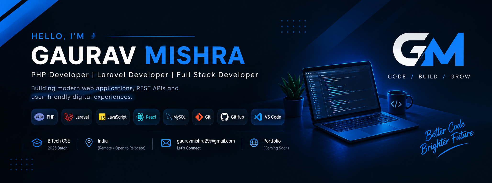

  

# 👋 Hi, I'm Gaurav Mishra

### 💻 PHP & Laravel Developer | Full Stack Developer

I am a passionate Computer Science graduate and PHP/Laravel Developer who enjoys building web applications, REST APIs and user-friendly interfaces.

---

## 🚀 About Me

- 🎓 B.Tech in Computer Science & Engineering
- 💻 PHP & Laravel Developer
- 🌐 Interested in Full Stack Web Development
- 🗄️ Working with MySQL & REST APIs
- ⚡ Learning and improving my development skills every day
- 📍 India

---

## 🛠️ Tech Stack

### Languages

### Frontend

### Backend

### Database & Tools

---

## 📌 Featured Projects

### 🍽️ Restaurant Management System
A web-based application for managing restaurant details and operations.

**Tech:** HTML, CSS, JavaScript

### 🛒 Ecommerce Flipkart
An e-commerce project inspired by Flipkart with product and shopping-related features.

**Tech:** Laravel, Blade

### 🏥 Hospital Management
Hospital management application for handling hospital-related data and operations.

**Tech:** Java

### 🎓 University Project
University management related web application.

**Tech:** Laravel, Blade

### 🎵 Spotify Clone
A music streaming interface inspired by Spotify.

**Tech:** HTML, CSS

---

## 📊 GitHub Stats

---

## 🤝 Connect With Me

---

⭐ From [GauravMishra29](https://github.com/GauravMishra29)
